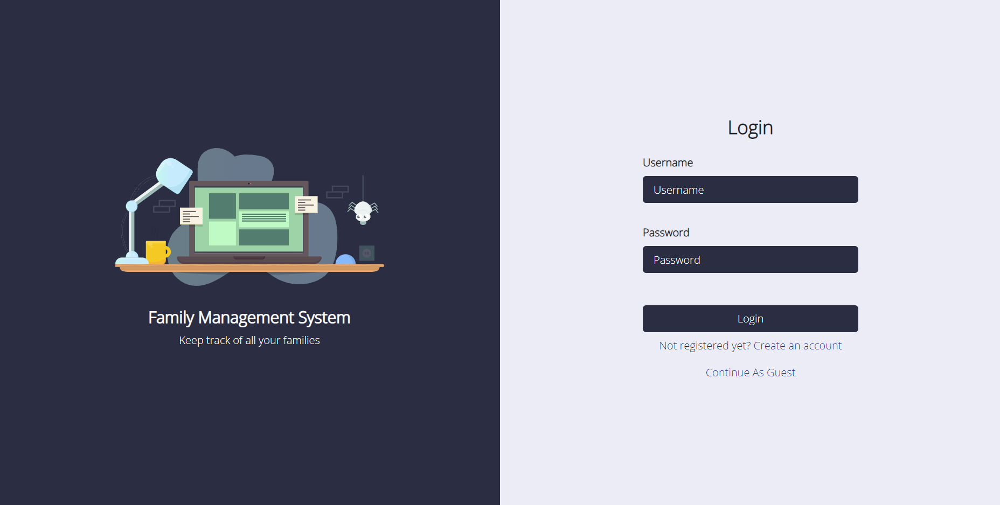
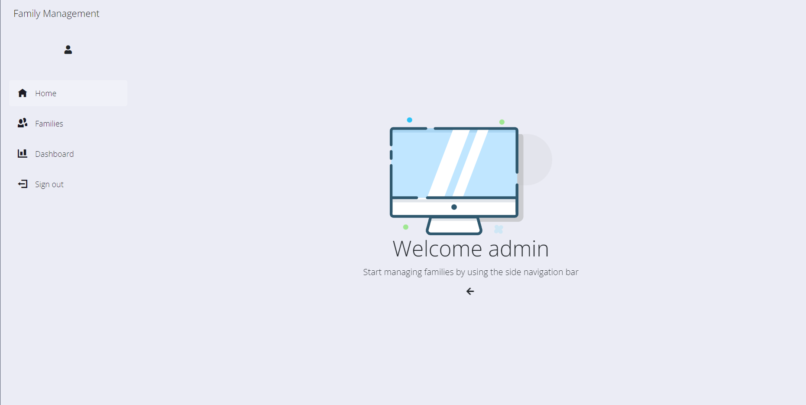
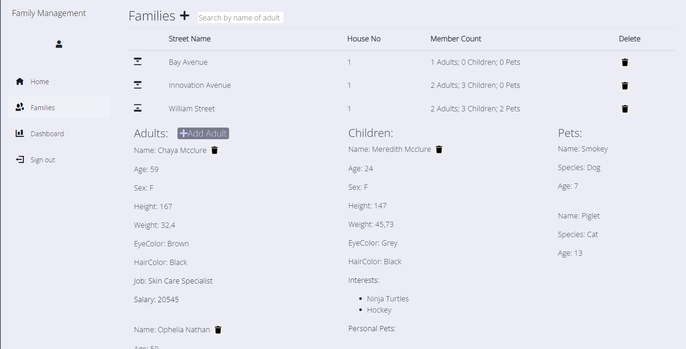
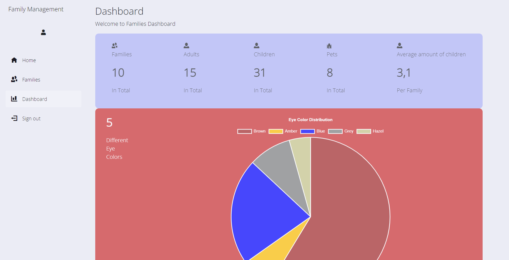

# FamilyManagementSystem
This system is an Family Management SPA created using Blazor (Server).
Styling is done with combination of Bootstrap and custom styling in SCSS. 

## Features
*   Account Creation
*   Login
*   Guest Login
*   Families View
      *   View Families and their members
      *   Add / Delete Families
      *   Add / Delete Family Members (Adults, Children, Pets)  
      *   Filter Families by Name of Adult
*   Dashboard View
      *   Stats of adults, children and pets in families
      *   Charts showing distribution of Eye Colors and Salary  
## Video Demo

## Screenshots

Login page

Account Creation

Home page

Families page

Dashboard

